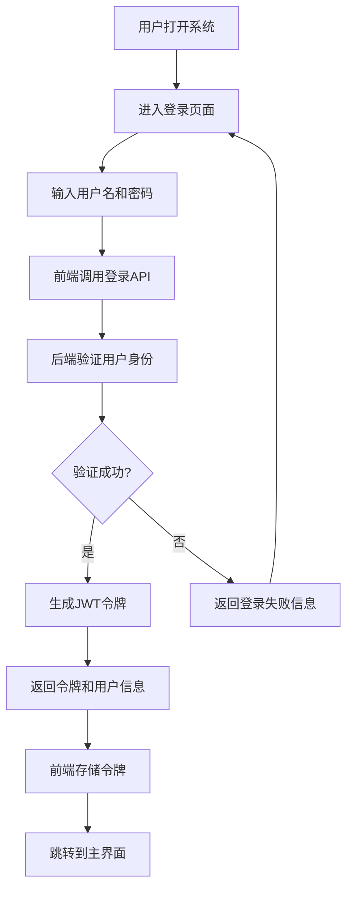
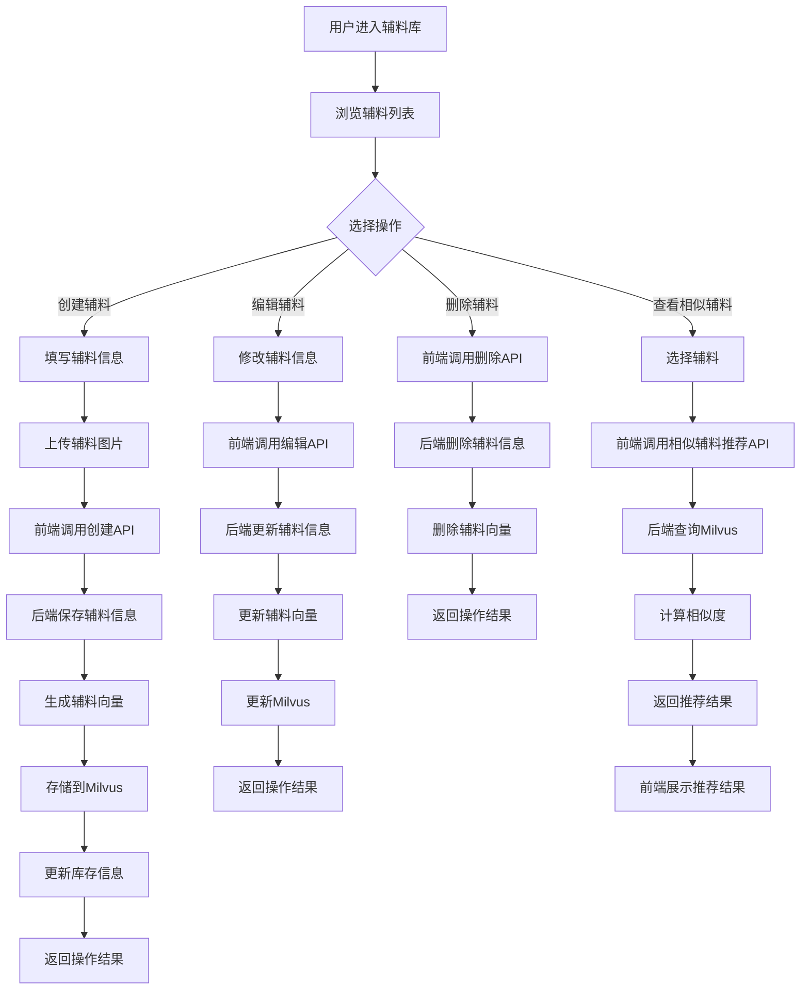
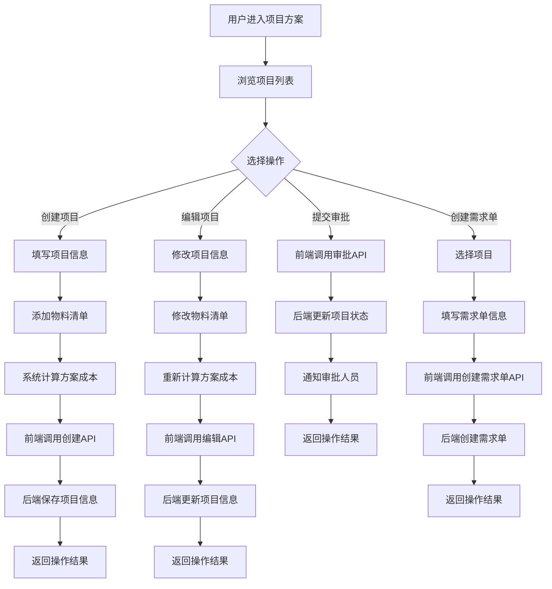
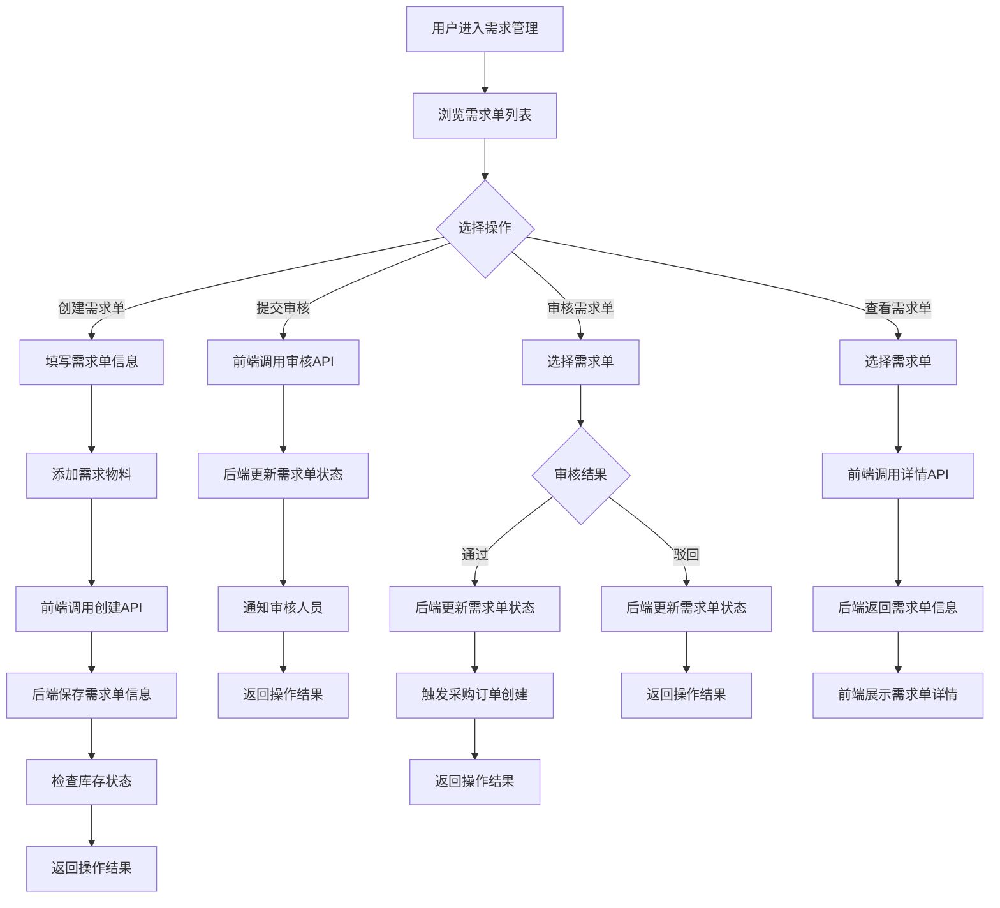
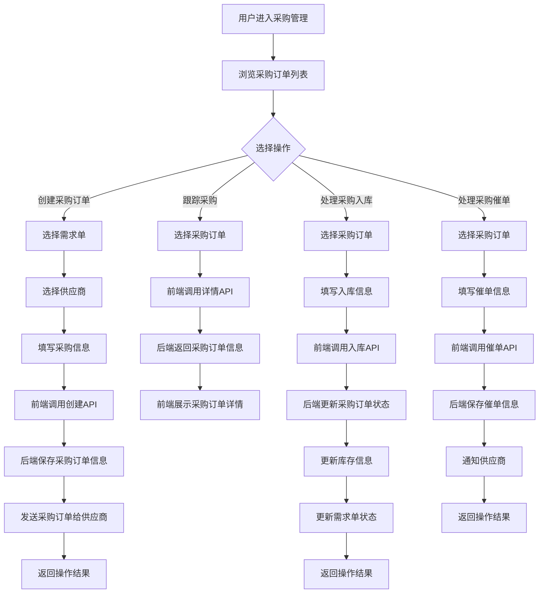
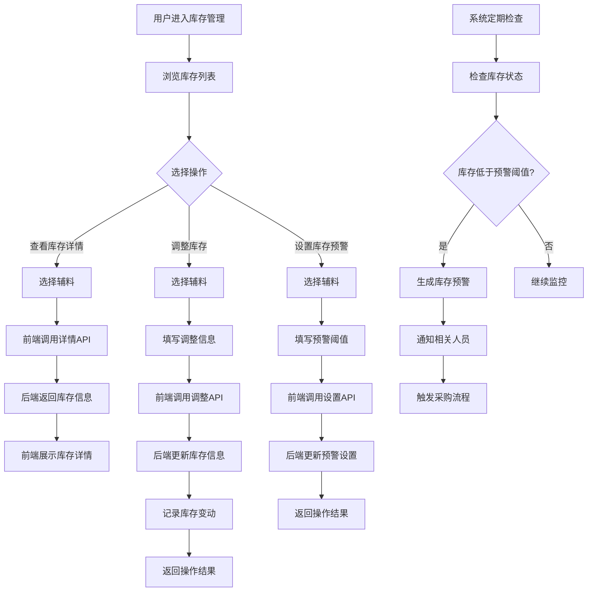
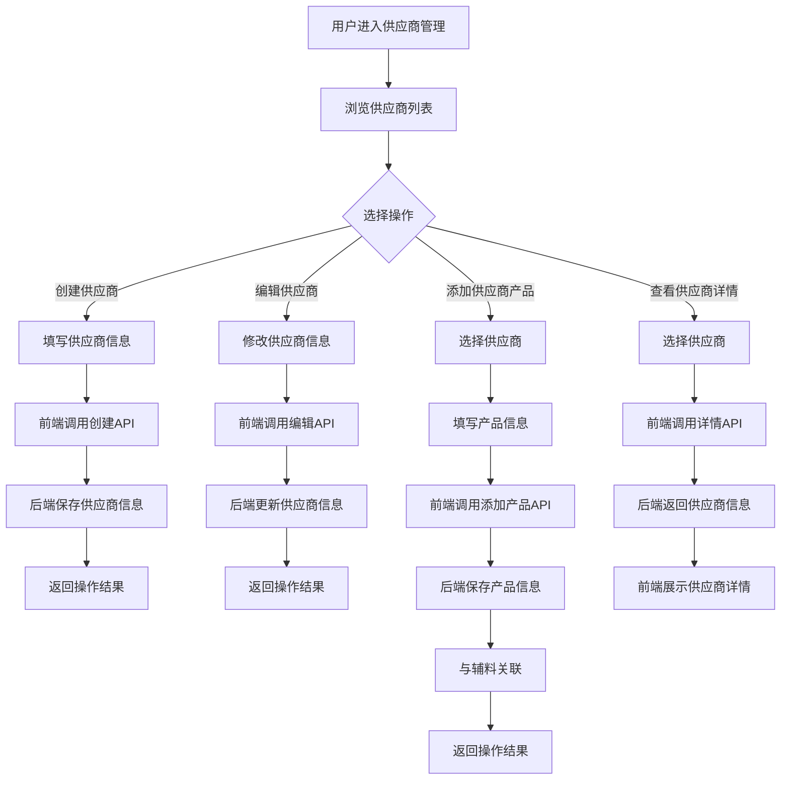
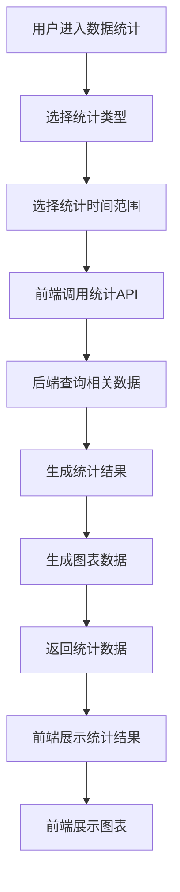
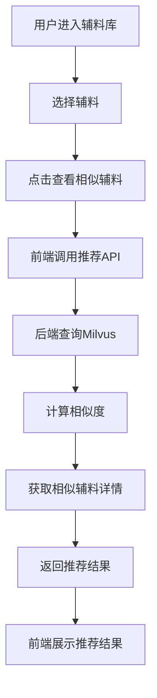
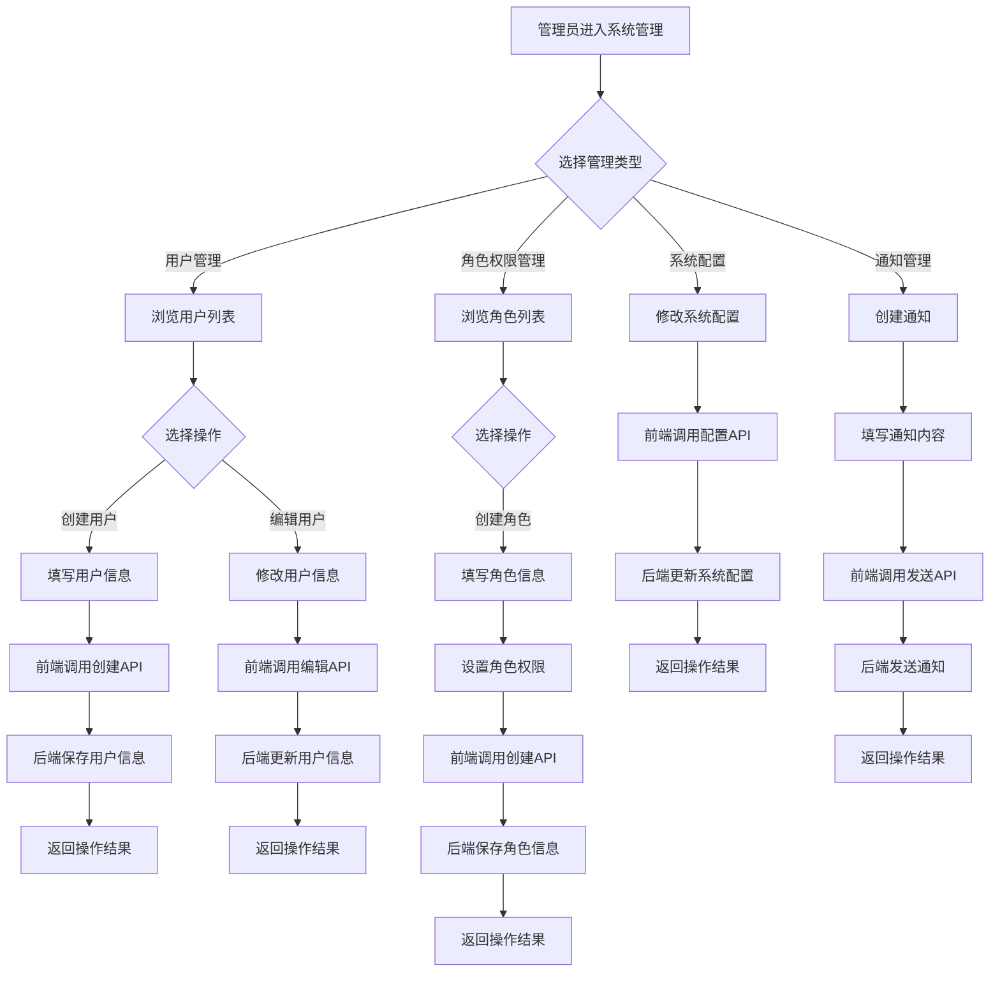

# WMS系统工作流程分析

## 1. 系统整体工作流程

WMS系统是一个完整的仓库管理系统，包含多个核心模块，这些模块之间存在密切的联动关系。系统的整体工作流程可以分为以下几个主要环节：

### 1.1 系统登录与认证

### 1.2 辅料管理流程

### 1.3 项目方案流程

### 1.4 需求单流程

### 1.5 采购管理流程

### 1.6 库存管理流程

### 1.7 供应商管理流程

### 1.8 数据统计流程

### 1.9 相似辅料推荐流程

### 1.10 系统管理流程

## 2. 系统核心业务流程

### 2.1 辅料全生命周期管理

**流程描述**：辅料从创建到使用的完整生命周期管理，包括辅料的创建、编辑、库存管理、相似辅料推荐等环节。

**工作流程**：
1. **辅料创建**：用户在前端创建辅料，上传图片，后端保存信息并生成向量
2. **库存管理**：系统监控辅料库存，当库存低于预警阈值时生成预警
3. **辅料使用**：项目方案、需求单、采购订单等模块使用辅料
4. **相似辅料推荐**：基于向量相似度推荐相似辅料
5. **辅料更新**：编辑辅料信息，更新向量和库存

**模块联动**：
- 辅料管理模块 → 库存管理模块：辅料库存更新
- 辅料管理模块 → 相似辅料推荐模块：辅料向量生成
- 项目方案模块 → 辅料管理模块：查询辅料信息
- 需求单模块 → 辅料管理模块：查询辅料信息
- 采购管理模块 → 辅料管理模块：查询辅料信息

### 2.2 项目方案到采购执行流程

**流程描述**：从项目方案的创建到采购订单的执行完成的完整业务流程。

**工作流程**：
1. **项目方案创建**：用户创建项目方案，添加物料清单，系统计算成本
2. **方案审批**：方案提交审批，审批人员审核通过
3. **需求单创建**：根据项目方案创建需求单，提交审核
4. **需求单审批**：审核人员审核需求单，通过后触发采购
5. **采购订单创建**：根据需求单创建采购订单，选择供应商
6. **采购执行**：跟踪采购执行状态，处理采购入库
7. **库存更新**：采购入库后更新库存状态
8. **需求单完成**：采购完成后更新需求单状态

**模块联动**：
- 项目方案模块 → 需求单模块：创建需求单
- 需求单模块 → 采购管理模块：创建采购订单
- 采购管理模块 → 库存管理模块：采购入库
- 采购管理模块 → 需求单模块：更新需求单状态
- 库存管理模块 → 需求单模块：库存状态检查

### 2.3 库存预警与采购流程

**流程描述**：当库存低于预警阈值时，系统自动生成预警并触发采购流程。

**工作流程**：
1. **库存监控**：系统定期检查库存状态
2. **库存预警**：当库存低于预警阈值时生成预警
3. **通知相关人员**：系统发送库存预警通知
4. **触发采购**：自动创建采购订单或提醒用户创建采购订单
5. **采购执行**：执行采购流程，完成采购入库
6. **库存更新**：采购入库后更新库存状态

**模块联动**：
- 库存管理模块 → 采购管理模块：触发采购
- 采购管理模块 → 库存管理模块：采购入库
- 系统管理模块 → 库存管理模块：发送预警通知

## 3. 系统工作流程总结

WMS系统的工作流程是一个复杂的、相互关联的过程，涉及多个核心模块的协同工作。通过以上分析，我们可以看到：

1. **系统架构**：采用前后端分离架构，后端使用Spring Boot，前端使用Vue 3，存储使用MySQL、Milvus、MinIO、Redis和RabbitMQ。

2. **核心模块**：系统包含用户认证、辅料管理、库存管理、项目方案、需求单、采购管理、供应商管理、数据统计、相似辅料推荐和系统管理等核心模块。

3. **模块联动**：各模块之间存在密切的联动关系，形成完整的业务流程。例如，项目方案、需求单、采购管理三个模块形成了一个完整的业务流程链。

4. **数据流向**：数据在模块间流动，确保系统的各个部分能够协同工作。例如，辅料信息从辅料管理模块流向库存管理、项目方案、需求单和采购管理模块。

5. **事件触发**：系统中的事件触发机制确保了业务流程的顺利进行。例如，需求单审核通过后触发采购订单创建，采购入库后更新库存状态。

6. **业务流程**：系统支持完整的业务流程，从项目方案的创建到采购订单的执行完成，形成了一个闭环。

7. **智能推荐**：基于Milvus向量数据库的相似辅料推荐功能，提高了系统的智能化水平。

8. **系统监控**：系统定期检查库存状态，当库存低于预警阈值时生成预警，确保系统的稳定运行。

WMS系统的工作流程设计合理，模块间的联动关系清晰，能够满足仓库管理的各种需求。通过本分析，运维人员可以更好地理解系统的工作原理，便于系统的维护和故障排查。